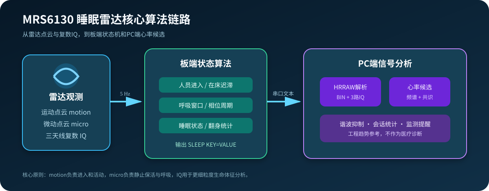
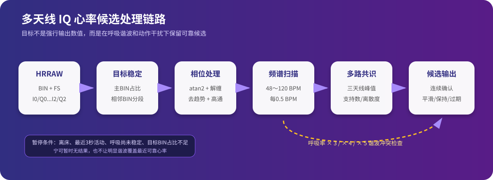
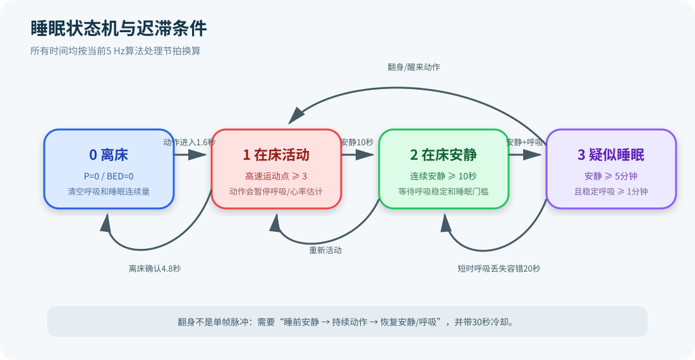

# MRS6130 Sleep Radar Algorithms

> MRS6130-P1812 毫米波睡眠监测核心算法：人员/在床检测、呼吸率估计、睡眠状态、翻身统计与多天线 IQ 心率候选分析。

本仓库从实际睡眠雷达工程中提取核心算法，并整理为便于阅读、测试和移植的最小代码结构。

> 生命体征与睡眠结果用于工程研发和趋势分析，不作为医疗诊断结果。

## 项目概览

| 模块 | 输入 | 核心方法 | 输出 |
|---|---|---|---|
| 人员与在床检测 | motion / micro点云 | 床区过滤、连续帧确认、迟滞状态机 | `P`、`A`、`BED` |
| 呼吸率估计 | 床区微动、目标BIN IQ相位 | 时间窗口、自相关、相位展开、候选稳定 | `BV`、`BR`、`Bper` |
| 睡眠状态 | 在床、活动、安静时长、呼吸连续性 | 四状态规则与短时丢失容错 | `SS`、睡眠段、中断 |
| 翻身统计 | 动作持续时间、动作前后安静状态 | 候选确认、恢复确认、事件冷却 | `TE`、`TC`、`STC` |
| 心率候选 | 多BIN、三天线复数IQ | 相位频谱、多路共识、呼吸谐波抑制 | 心率候选、质量和覆盖率 |

仓库只保留算法、最小数据结构、单元测试和解释图，不包含厂商完整SDK、CDK工程、GUI、通信服务、驱动或烧录镜像。

## 算法全景



算法链路分为两部分：

1. 板端以5 Hz节拍处理点云和呼吸相位，输出结构化状态字段；
2. PC端解析三天线IQ，进一步计算心率候选和会话统计结果。

## 核心算法一：呼吸率检测

呼吸算法运行在板端，核心实现位于[`firmware/sleep_detect.c`](firmware/sleep_detect.c)。它同时利用床区micro点数量和目标距离BIN的IQ相位；其中IQ相位链路是主要的呼吸率数值来源。

处理流程为：

1. 只在已入床且无明显体动时接收目标BIN相位；
2. 将`atan2(Q, I)`得到的周期相位展开为连续相位；
3. 在呼吸频率对应的时延范围内计算自相关，寻找最佳周期；
4. 将周期换算为每分钟呼吸次数；
5. 对候选值执行重复确认、变化限速和短时保持。

### IQ相位展开

相位在`-π～π`之间跳变，必须先消除`2π`回绕；过大的单帧相位变化会被视为异常点。

```c
delta = phase_mrad - g_sleep_state.breath_phase_last_mrad;
while (delta > 3142) {
    delta -= 6283;
}
while (delta < -3142) {
    delta += 6283;
}

if (delta > BREATH_PHASE_DELTA_MAX_MRAD ||
    delta < -BREATH_PHASE_DELTA_MAX_MRAD) {
    g_sleep_state.breath_phase_last_mrad = phase_mrad;
    return;
}

g_sleep_state.breath_phase_last_mrad = phase_mrad;
g_sleep_state.breath_phase_unwrapped_mrad += delta;
sleep_detect_push_breath_phase(g_sleep_state.breath_phase_unwrapped_mrad);
```

### 自相关周期搜索

算法仅搜索合理呼吸率对应的时延区间，并选择平均相关性最高的周期：

```c
for (uint16_t lag = min_lag; lag <= max_lag; ++lag) {
    int64_t score = 0;
    uint16_t samples = count - lag;

    for (uint16_t i = lag; i < count; ++i) {
        int64_t cur = sleep_detect_get_breath_phase_sample(i) - mean;
        int64_t prev = sleep_detect_get_breath_phase_sample(i - lag) - mean;
        score += cur * prev;
    }

    score = samples > 0 ? score / samples : 0;
    if (score > best_score || (score == best_score && lag > best_lag)) {
        best_score = score;
        best_lag = lag;
    }
}

return (uint16_t)((60U * 1000U) /
                  (best_lag * BREATH_SAMPLE_PERIOD_MS));
```

得到的瞬时候选不会直接发布。相邻候选在容差范围内连续出现后才更新稳定值，大幅变化需要更长确认时间；短时无有效周期时继续保持最近的稳定结果。完整逻辑见[`sleep_detect_stabilize_breath_rate()`](firmware/sleep_detect.c)。

## 核心算法二：心率检测

心率算法位于[`host_algorithm/heart_rate.py`](host_algorithm/heart_rate.py)，支持5 Hz单BIN安全采样和20 Hz多BIN实验数据。



处理流程为：

1. 解析`HRRAW`中的目标BIN、多BIN数据和三路天线IQ；
2. 按BIN切分连续数据段，避免不同距离单元的相位被直接拼接；
3. 对每路天线执行相位展开、线性去趋势和移动均值高通；
4. 在48～120 BPM范围进行0.5 BPM步进的窄带频率扫描；
5. 汇总多个BIN，并从三路天线峰值中选择共识候选；
6. 使用呼吸率检查二、三倍频及高阶谐波重叠；
7. 经过连续确认、平滑、变化限速、保持和过期后输出。

### 从IQ提取心跳频谱

每个BIN、每根天线独立处理，先将复数IQ转换为连续相位，再去除慢漂移：

```python
timestamps = [sample.timestamp - samples[0].timestamp for sample in samples]
phase = self._unwrap_phase(
    [self._antenna_iq_for_bin(sample, bin_index)[antenna]
     for sample in samples]
)
filtered = self._high_pass(self._detrend(phase, timestamps), sample_rate)
return [self._power_at_bpm(filtered, timestamps, bpm) for bpm in bpms]
```

频率扫描直接计算指定BPM下的复数投影功率，并使用Hann窗降低频谱泄漏：

```python
omega = 2.0 * math.pi * (bpm / 60.0)
real = imag = 0.0

for index, (timestamp, value) in enumerate(zip(timestamps, values)):
    window = 0.5 - 0.5 * math.cos(2.0 * math.pi * index / last)
    angle = omega * timestamp
    weighted = value * window
    real += weighted * math.cos(angle)
    imag -= weighted * math.sin(angle)

power = real * real + imag * imag
```

### 三天线共识

单根天线容易受到姿态、遮挡和多径影响，因此算法要求候选在至少两路天线中落入同一频率簇，并综合峰值质量与离散度排序：

```python
for center in centers:
    matches = []
    for antenna_peaks in peaks_by_antenna:
        nearby = [peak for peak in antenna_peaks
                  if abs(peak.bpm - center) <= 4.0]
        if nearby:
            matches.append(max(nearby, key=lambda peak: peak.score))

    if len(matches) < 2:
        continue

    total_score = sum(peak.score for peak in matches)
    weighted_bpm = sum(peak.bpm * peak.score for peak in matches) / total_score
    spread = max(peak.bpm for peak in matches) - min(peak.bpm for peak in matches)
    rank = total_score + 1.5 * (len(matches) - 1) - spread * 0.25
```

### 呼吸谐波抑制

呼吸信号通常强于心跳，其三倍频可能正好落入静息心率范围。算法不会简单删除该频段，而是比较心率候选与`3 × 呼吸率`的历史相关性：若候选持续跟随呼吸谐波变化，则标记冲突；若两者变化相互独立且心率候选足够稳定，则允许保留。

```python
heart_values = [candidate for candidate, _rate in history]
harmonic_values = [rate * 3.0 for _candidate, rate in history]
correlation = self._correlation(heart_values, harmonic_values)
heart_spread = statistics.pstdev(heart_values)

independent = (
    max(harmonic_values) - min(harmonic_values) >= 9.0
    and abs(correlation) < 0.20
    and heart_spread <= 2.5
)
harmonic_conflict = not independent
```

## 其他睡眠算法

板端接口和结果结构定义在[`firmware/sleep_detect.h`](firmware/sleep_detect.h)。

### 人员、活动与在床判断

- motion点负责检测人员进入和明显活动；
- micro点只在已经入床后参与静止保活；
- 床区坐标过滤排除范围外反射；
- 进入和离开分别采用独立连续帧门槛，避免状态抖动；
- 活动点数量与速度共同生成四级体动强度。

### 睡眠状态与翻身



| 状态值 | 状态 | 主要条件 |
|---:|---|---|
| `0` | 离床 | 人员或在床状态退出 |
| `1` | 在床活动 | 检测到有效活动点 |
| `2` | 在床安静 | 持续安静达到确认时间 |
| `3` | 疑似睡眠 | 长时间安静且呼吸持续有效 |

翻身事件采用“动作前安静 → 持续动作 → 恢复安静和呼吸”的完整过程确认，并设置事件保持和冷却时间。

## 配套上位机功能

### 会话统计

[`host_algorithm/session_metrics.py`](host_algorithm/session_metrics.py)负责：

- 心率均值、范围和有效覆盖率；
- 最近十分钟的呼吸率、心率、翻身和体动汇总；
- 0～100工程体动指数；
- 长时间无有效值和低覆盖率提醒。

## 数据接口

### SLEEP状态行

```text
SLEEP P=1 A=0 BED=1 BV=1 BR=18 SS=3 MI=0 TE=0 TC=2 STC=1 BVR=91 RVR=84
```

常用字段：

| 字段 | 含义 |
|---|---|
| `P / A / BED` | 人员、活动、在床状态 |
| `BV / BR` | 呼吸有效性与呼吸率 |
| `SS` | 睡眠状态 |
| `MI` | 体动强度 |
| `TE / TC / STC` | 翻身事件、总翻身、睡眠中翻身 |
| `BVR / RVR` | 呼吸信号有效率与数值输出覆盖率 |

最小解析器位于[`host_algorithm/sleep_protocol.py`](host_algorithm/sleep_protocol.py)。

### HRRAW原始IQ

```text
HRRAW F=100 FS=5 V=1 A=0 BED=1 BIN=12 ANT=1 I0=120 Q0=-45 I1=98 Q1=-62 I2=80 Q2=-31
```

`F`为帧号，`FS`为采样率，`BIN`为目标距离单元，`I0/Q0～I2/Q2`为三路天线复数IQ。

## 默认配置

以下参数按当前5 Hz算法处理节拍换算：

| 参数 | 默认值 | 作用 |
|---|---:|---|
| 床区X | -50～50 cm | 左右范围 |
| 床区Y | 50～180 cm | 雷达前方距离 |
| 床区Z | -70～70 cm | 高度范围 |
| 入床确认 | 8帧 / 1.6秒 | 抑制瞬时运动误触发 |
| 离床确认 | 24帧 / 4.8秒 | 提供短时信号丢失容错 |
| 安静确认 | 50帧 / 10秒 | 进入在床安静状态 |
| 呼吸稳定 | 300帧 / 1分钟 | 支持疑似睡眠判断 |
| 疑似睡眠 | 1500帧 / 5分钟 | 安静状态持续门槛 |
| 翻身冷却 | 150帧 / 30秒 | 避免同一动作重复计数 |

## 目录结构

```text
firmware/
├─ radar_types.h       最小点云数据类型
├─ sleep_detect.h      板端算法接口与结果结构
└─ sleep_detect.c      存在、呼吸、睡眠和翻身算法

host_algorithm/
├─ heart_rate.py       多BIN、多天线心率候选算法
├─ session_metrics.py  会话统计与监测提醒
└─ sleep_protocol.py   SLEEP文本协议解析器

tests/                 Python算法测试
docs/                  算法流程图
```

## 测试

Python部分只依赖标准库：

```powershell
$env:PYTHONDONTWRITEBYTECODE='1'
python -m unittest discover -s tests -v
```

当前验证状态：

- 37项Python算法测试通过；
- 板端C算法通过RISC-V GCC C11语法检查；
- 三张SVG流程图通过XML和渲染检查。

## 集成到MRS6130 SDK

独立仓库中的`radar_types.h`只提供算法所需的最小点云类型。集成回厂商SDK时，可将`sleep_detect.h`中的引用恢复为`mmw_type.h`。

点云回调中的核心调用方式：

```c
sleep_detect_update(motion_points, motion_count, micro_points, micro_count);
sleep_detect_update_breath_phase(valid, target_bin, phase_mrad, amplitude);

const SleepDetectResult *result = sleep_detect_get_result();
```
